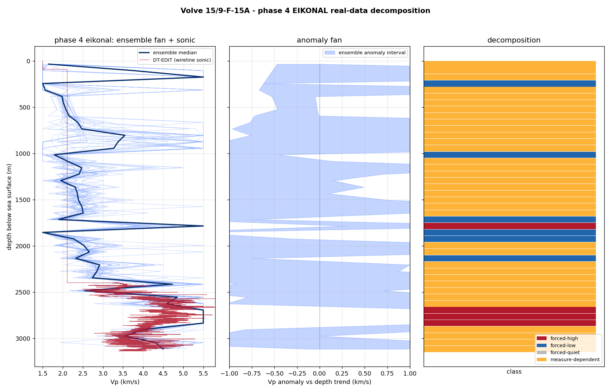
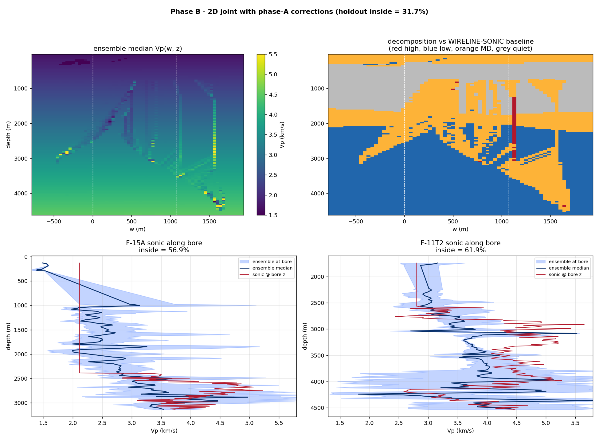
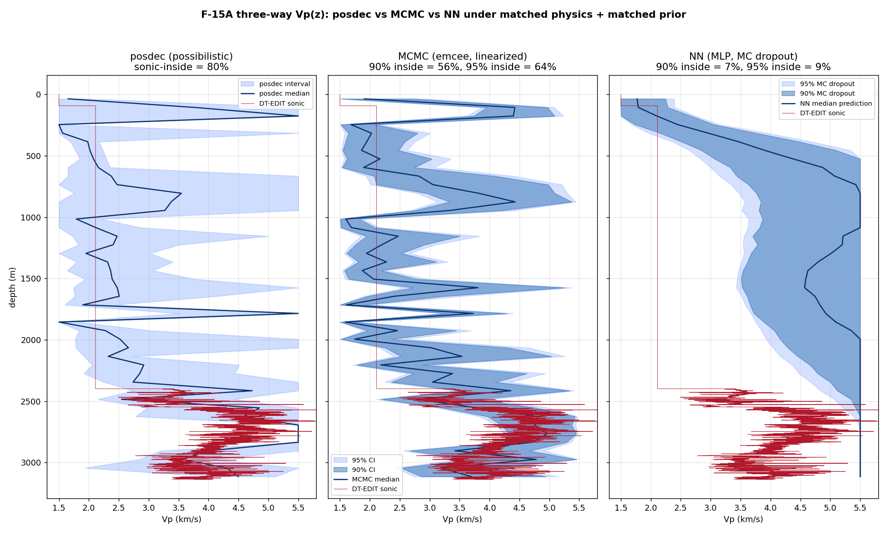

# Possibilistic Decomposition of a Tomographic Inversion

### Separating data-forced structure from regularization artifact

**Aaron Green** — draft prepared for Zagid Abatchev, 2026-05-17.

---

## What this is

A tomographic image is not a picture of the Earth. It is the output of a long
chain of lossy, selective steps — sparse rays, a simplified forward model, a
parameterization, a regularizer, an optimizer — and what survives that chain is
not the structure but a *filtered residue* of it. You and I have said as much
to each other already. The practical question that framing forces is the one
this note is about:

> **Given a finished inversion, which features did the data force, and which
> did the regularization invent?**

Standard practice does not answer that question. It picks a damping value,
returns one model, and attaches a posterior covariance — and every part of that
is conditional on the damping choice. Your own thesis says it plainly: "there
is no simple solution for regularization, and optimization of damping
conditions remains a highly parametrization and input dependent problem"
(ZTM/TFM, §11).

This note proposes a different reading of an inversion — a **possibilistic**
one — and demonstrates it end-to-end on synthetic travel-time tomography with
two forward operators, straight-ray and Eikonal. It is a methods communication
and a draft; the demonstrations are synthetic; nothing here is claimed as
proven. What I am claiming is that the reading is sound, that it is implemented
and validated against known ground truth, and that the place it stops working
cleanly is a real open problem worth our working on together.

---

## 1. The problem: a damping choice is not a fact

Tomographic inversion is ill-posed. Many models fit the data within noise. To
return *one* model you must regularize — damp, smooth, prefer a reference —
and the model you get is as much a property of that choice as of the data.

The honest consequence: a feature in a tomographic image belongs to one of
three classes, and they are not the same kind of thing.

| Class | Meaning |
|---|---|
| **Forced** | Present in *every* model consistent with the data and the hard physical bounds. Data-determined. Independent of the damping choice. |
| **Forbidden** | Present in *no* such model. |
| **Measure-dependent** | Present in *some* consistent models and absent in others. The data do not determine it — which sign or structure you see is set by the regularization. Such a feature may still be physically real: measure-dependence diagnoses *underdetermination*, not falsehood. |

A posterior covariance does not draw this line. It reports a spread *under one
prior and one damping*; it cannot tell you that a given feature would vanish
under a different, equally defensible choice. The damping problem of §11 is, in
this language, a symptom of reading an inversion through the wrong layer: it is
the search for the "right" measure-layer choice to extract a model, when the
features that *depend* on that choice are exactly the ones the data does not
determine.

---

## 2. The possibilistic frame

The distinction in §1 is the **possibilistic / probabilistic** split, taken
from the two-layer discipline of the Closure Forces Structure programme
(`inverse_born_methodology.md`) and carried over to inversion:

- The **possibilistic layer** asks what is *forced or forbidden* by the data
  and the hard physical constraints alone. Its answers are unconditional — they
  do not depend on a prior, a damping value, or a measure.
- The **probabilistic layer** asks how a measure distributes weight over what
  the possibilistic layer permits. Its answers are conditional on that measure.

A posterior covariance is a probabilistic-layer object. The possibilistic
layer is the one that answers the §1 question, and it is the one standard
tomography leaves on the table.

One clarification carries the rest. Throughout, F is the *hard* admissibility
set — every model that fits within the noise tolerance and obeys the hard
physical bounds — and the probabilistic layer is taken as conditional on that
admissibility. With a smooth likelihood a posterior need not vanish sharply
outside F; the two-layer reading treats F as the tolerance-defined region and a
measure μ as a measure on it. Every "measure on F" below — and every bound
stated in terms of "F's extent," including Figure 3's — is a claim about
admissible μ in that conditional sense, not about an untruncated
smooth-likelihood posterior.

The split has a natural geometry, and the next three figures build it up one
idea at a time.

**Figure 1 — the feasible set.** The data and the hard constraints do not pick
out a model; they pick out a *set* F of models — every model that fits within
noise and respects the bounds. F is a set, not a probability density — the
figures shade it only to mark the region. Project F onto a feature's axis and
the feature
falls into one of two classes. It is **forced** when the projection lies
entirely on one side of zero: every model consistent with the data agrees on
its sign, and no prior is needed to settle it. It is **measure-dependent** when
the projection straddles zero: the data leave the sign open, and any single
value reported there is fixed by the measure you add, not by the data.

*Figure 1. The data give a set, not a point. A feature is forced when F's
projection clears zero and measure-dependent when it straddles zero — the two
terms this note turns on, defined geometrically.*

**On the word "possibilistic."** I use it in a deliberately narrow sense — the
crisp-set limit of possibility theory, equivalently a set-valued feasibility
reading, not a graded possibility distribution. F is an ordinary feasible set:
a model is in it or it is not. A
feature is *forced* exactly when a fact holds for every model in F (necessity 1,
in possibility-theory terms) and *measure-dependent* when F neither forces nor
forbids it. No fuzzy membership is invoked; the only structure used is the set
F and the all-or-nothing quantifier over it.

**Figure 2 — two reports.** The same F can be turned into a reported answer two
ways. The *possibilistic report* uses exactly F: forced features pinned to a
sign, measure-dependent features returned as intervals — no more information
than F carries, and no less. The *Bayesian report* uses F plus a measure μ — it
places μ on F and reports its mean and credible interval. μ is information
beyond F, and two defensible choices of μ can disagree on a measure-dependent
feature's sign, so that choice needs a justification of its own. On a forced
feature the two reports agree; the divergence is confined to the
measure-dependent ones.

*Figure 2. Two reports from one feasible set. Possibilistic: use exactly F.
Bayesian: use F plus a measure μ — defensible μ agree where F forces the answer
and can conflict where it does not.*

**Figure 3 — the layers compose.** The two are not rivals run side by side;
they compose in sequence. The possibilistic layer runs first and bounds which
measures are admissible — a measure is admissible only if it is supported on F.
The Bayesian layer then runs inside that bound: across all admissible
measures, the *attainable range of reported answers* — the measure-uncertainty
— cannot exceed F's extent. On a forced feature that bound clears zero, so no admissible measure
can move the sign; on a measure-dependent feature it straddles zero and the
sign is genuinely open. Possibilism does not compete with Bayes — it brackets
it.

*Figure 3. The layers compose. Possibilism runs first and bounds the admissible
measures; the Bayesian sweep then stays inside that bound. The feasible
interval below is exactly that bound.*

The object that carries the possibilistic content is the **feasible
interval**. Take an ensemble of models that each fit the data within noise and
respect the hard bounds. For each cell, record the interval `[a_min, a_max]` of
the anomaly across the ensemble. That interval is F projected onto the cell's
axis — exactly the bound Figure 3 draws:

- `a_min > 0` everywhere in the ensemble → **forced-high** (no data-consistent
  model makes this cell non-positive);
- `a_max < 0` → **forced-low**;
- the interval straddles zero → **measure-dependent** (the sign itself is not
  data-forced);
- the interval sits inside a small band around zero → **forced-quiet**.

Figure 4 puts the classification on a concrete ensemble. The same ensemble,
read two ways: the probabilistic reading collapses it to a mean and an error
band; the possibilistic reading keeps the feasible interval and classifies it.
The big feature is forced; the flanks and the small bump are measure-dependent
— and the probabilistic band does not distinguish them.

*Figure 4. The same feasible ensemble, read two ways. Left: one model, one
uncertainty band. Right: the feasible interval, classified.*

**On prior art — said straight.** This is not unprecedented, and pretending
otherwise would not survive five minutes of your scrutiny. Computing bounds on
what a model *can* be, rather than a single estimate, is the spirit of
Backus–Gilbert extremal inversion (1968); the under-determined directions are
the null space of resolution analysis; multi-model joint coupling has the
Gramian-constraint literature (Zhdanov, 2012 onward). And a transdimensional /
reversible-jump MCMC posterior ensemble (Bodin & Sambridge, 2009) already
*contains* this information — forced structure appears as high-consensus,
measure-dependent structure as sign-variable posterior mass. The epistemic
intuition is old. What I am putting forward is narrower: not a new inverse-theory
principle but a *reporting discipline* — the forced / measure-dependent split
made an explicit, first-class output; measure-dependence treated as the
operational diagnostic of *underdetermination*; and the whole run as a
transferable, documented procedure on top of arbitrary inversion machinery,
rather than the informal robustness check practitioners already perform
inconsistently. The contribution is the operationalization, not the distinction.

---

## 3. Method

**The feasible set.** A model is *feasible* if it (a) fits the data to within
the noise level and (b) satisfies the hard physical bounds. The bounds are not
left implicit: `geophysical_invariants.md` stratifies them into Tier-1
(frame-independent — positivity, first-arrival minimality, a generous velocity
envelope; used freely), Tier-2 (frame-dependent — typical mantle/crust values,
reference Earth models, petrophysical relations; soft priors only), and Tier-3
(the observational context). The possibilistic feasible set is bounded by
Tier-1 alone. Worth noting in passing: TFM currently clamps node velocities to
7.5–9.5 km/s and initializes from IASP91 — Tier-2 values used as hard limits.
That is the layer-confusion the stratification is meant to catch.

**Sampling it.** Generate many feasible models by inverting toward many random
reference models, each inversion taken to the point where its misfit equals the
noise level. The references diversify the data-null directions; the
data-resolved directions are common to all. Then read the feasible interval
and classify it (§2).

**The decomposition is forward-model-agnostic.** It operates on the ensemble of
models; it does not care how they were produced. That is the point of the two
demonstrations below: the *same* decomposition code runs on a linear straight-
ray operator and a nonlinear Eikonal operator.

---

## 4. Demonstration 1 — straight-ray operator (linear)

A synthetic velocity model: one large tilted high-velocity slab, one broad
low-velocity zone, three small sub-resolution blobs. Synthetic first-arrival
times with 1.2% noise, dense four-edge ray coverage. The feasible set is
sampled exactly per §3 (the linear operator admits an exact eigendecomposition,
so the feasible set is parametrized cleanly).

Figure 5 is the result. The forced-sign cores sit on the true features — panel
(e), the black forced-high contour lies inside the true slab, the white
forced-low contour inside the true low-velocity zone. The numbers:

- **Forced cores are correct.** ~7 sign errors within the resolution length out
  of ~300 forced cells (~2%). What the method certifies, the ground truth
  bears out.
- **The measure-dependent shell captures ~89% of the sub-resolution blob
  cells** — it correctly flags the detail the data cannot pin down.
- **The forced set is conservative**: ~19% of the grid is sign-certain. This is
  not a weakness. It is the method saying out loud what is true — most of a
  tomographic image is *not* forced.

*Figure 5. The straight-ray (linear) demonstration. Panel (d) is the
decomposition; panel (e) shows the forced cores landing on the true features.*

---

## 5. Demonstration 2 — Eikonal operator (nonlinear)

The straight-ray operator is exact only in a homogeneous medium. The faithful
operator is the Eikonal first-arrival solver — the operator class your FMM.cpp
implements. First-arrival rays bend: toward fast structure, away from slow
(Figure 6). `eikonal.py` provides it (Fast Marching Method solver + ray-path
Fréchet kernel), standalone and self-tested.

*Figure 6. Why the forward operator matters. Solid: Eikonal first-arrival rays,
bending through the medium. Dashed: the straight-ray approximation.*

Because travel time is now a nonlinear functional of slowness, the one-shot
linear solve is replaced by an iterative Levenberg–Marquardt inversion that
recomputes the ray paths through the current model — the DGN + FMM structure of
your own pipeline. Figure 7 is the result, and the decomposition code is
*identical* to Demonstration 1:

- **Forced cores ~89% sign-correct within the resolution length**, but ~71–81%
  strict (cell-exact). The gap is resolution-length blur — a forced cell one or
  two cells off a true feature edge, not a sign mistake — but the strict figure
  is the honest co-headline; the within-resolution number alone overstates the
  precision.
- **The measure-dependent shell captures ~76% of the blobs.**

These figures are from the feasible-set sampler at its default operating point,
and at that operating point the forced set itself over-claims: an adversarial
stress test (§7 point 6; `witness_pass.md`, RWC-2) finds ~41% of forced cells
admit a feasible, equally-smooth, opposite-sign model. The decomposition layer
is sound and forward-model-agnostic; what is coverage-limited is the
feasible-set *sampling* that feeds it (§8).

The decomposition transferred across two genuinely different forward operators
without change. That is the load-bearing result of this note: the possibilistic
reading is a property of *inversions*, not of a particular operator.

*Figure 7. The Eikonal (nonlinear) demonstration — same decomposition, faithful
operator.*

---

## 6. Demonstration 3 — real-data on the Volve walkaway VSP

Demonstrations 1 and 2 validate the methodology against synthetic ground truth.
This section asks the next question: does any of it survive contact with a real
field dataset? The **Equinor Volve open release** (North Sea, 2018), made
available under Equinor's *HRS Terms and conditions for licence to data — Volve*
(§6.6), includes walkaway-VSP surveys for two wells with full wireline-log
suites — independent sonic ground truth at known locations. The data pipeline
from raw SEG-Y to forced/measure-dependent classification is shipped in the
`volve/` subpackage of this repository; the report below is what came out of
it.

### 6.1 1D Vp(z) on well 15/9-F-15A — the methodology calibrates

Picks: STA(10 ms)/LTA(100 ms) trigger with AIC refinement on the Z-component
geophone traces, 1215 ok of 1248 (97.4% yield; the 33 no-trigger traces are
the 5 far-offset sources). Ensemble: 30 random-reference Eikonal Gauss–Newton
members on 45 depth bins (70 m), envelope `[1.5, 5.5]` km/s, smoothness
correlation 250 m. Validation: the LAS bundle's `DT-EDIT` sonic curve,
checkshot-stretched to TVD.

Headline numbers, real data:

- **Per-bin ensemble Vp interval covers the wireline sonic in 36/45 bins
  (80.0%).**
- **Held-out arrival calibration: 228/243 (93.8%) of held-out pick times fall
  inside the ensemble's predicted-time interval.**
- Signed error (ensemble median minus sonic) median +0.29 km/s; the ensemble
  runs slightly slow at depth, consistent with the first-order FMM solver and
  the 1D-along-bore parameterization.

*Figure 8. Possibilistic decomposition on the 15/9-F-15A walkaway VSP.
Left: 30-member ensemble Vp(z) fan against the DT-EDIT wireline sonic.
Centre: the per-bin anomaly interval relative to the depth trend. Right:
the forced-high / forced-low / measure-dependent classification. The
ensemble's per-bin Vp interval covers the wireline sonic in 80% of depth
bins, and the held-out arrival calibration lands at 93.8% — at the rate
the possibilistic frame claims for full-coverage forecasts.*

That is the "methodology mechanically works on real first arrivals" outcome.
Calibration matches the methodology's claim; the operator-relative caveats of
section 8 apply unchanged.

### 6.2 2D joint inversion on F-15A + F-11 T2 — structural misspecification surfaces

Two wells are 1061 m apart laterally; combined they sample depths
≈ 130 – 4530 m. Promoting to 2D Vp(w, z) on a (well-line, depth) grid
through both wellheads multiplies the model space ~180× (45 bins → 8004 cells)
without 180× more data, and changes the inversion's character.

Three rounds of work were needed to get an honest read:

1. **First-cut report.** A 12-member ensemble × 2 Gauss–Newton iterations
   produced sonic-inside coverage of 10 % at each well's wellhead column, a
   joint held-out inside rate of 23 %, and 79 % "forced-quiet" cells. The
   narrative on first read was *"prior dominance in unilluminated cells."*
2. **Triad witness pass.** A scoped brief went to three independent AI
   witnesses (Venice / Grok / ChatGPT). They converged on four interpretation
   artifacts the first read was leaning on: the anomaly baseline was the
   ensemble mean (gauge-sensitive), the sonic was sampled at the wellhead
   column instead of along the deviated bore (category error), the ensemble
   size was small (under-exploration risk), and the prior strength was not
   directly tested. ChatGPT specifically named the structural-misspecification
   hypothesis — *2D Vp(w, z) on a 3D Earth* — as the leading alternative.
3. **Phase A diagnostics + Phase B re-run.** Each artifact was tested in
   sequence. Switching to a wireline-derived anomaly baseline collapsed the
   79 % forced-quiet to 22 % (the original number was gauge-sensitive).
   Sampling the sonic along the bore trajectory raised the F-15A
   sonic-inside from 10 % → 32 % (post-processing) → **57 %** (Phase B
   re-inversion, 30 members × 3 GN iters, looser prior). Loosening the
   smoothness correlation 350 → 700 m and the envelope 1.5 – 5.5 → 1.3 –
   6.0 km/s did **not** widen the predicted-time interval (21 ms → 24 ms)
   and did **not** shrink the held-out residual (137 ms → 134 ms RMS).
   Across all 30 members, 44 % of cells classify as **forced-low** against
   the wireline-sonic baseline — the ensemble systematically sits below the
   sonic, and the diagnosis is stable.

*Figure 9. 2D Vp(w, z) joint inversion of the F-15A + F-11 T2 picks
(Phase B, with the witness-pass artifact corrections applied). Top:
ensemble median Vp(w, z) and the forced/measure-dependent classification
versus the wireline-sonic baseline (red high, blue low, orange
measure-dependent, grey forced-quiet). Bottom: sonic-along-bore vs
ensemble at each well — 57 % (F-15A) and 62 % (F-11 T2) inside the
ensemble interval. The persistent 44 % forced-low (blue) at depth is the
diagnostic: 2D Vp(w, z) is structurally insufficient for the 3D Earth at
this geometry, and the methodology reports it.*

The methodology is doing what it should. The ensemble has ten effective
dimensions (it is exploring genuine diversity, not collapsing onto a single
member), and yet every member fits the picks but sits below the sonic at
depth. The 44 % forced-low survives prior loosening because the binding
constraint is the parameterization itself, not the prior strength. *That* is
what "the forward operator (or parameterization) is the load-bearing
approximation" looks like in real data, and the decomposition correctly
flags it.

### 6.3 The witness pass as part of the method

The witness pass and the four corrections it produced are themselves part of
the methodology contribution. The discipline is: *publish the first-cut
interpretation, run external witnesses on the brief, run the diagnostics they
recommend, retract the parts that were gauge-sensitive or confounded, re-run
with the corrections, and re-report.* This was the second time in the
methodology's development that triad witnesses caught an interpretation drift
(the first was the possibilism note's figure pass with Crane and Martin); the
practice is now treated as a step in the workflow, not an extra.

### 6.4 Head-to-head: possibilistic vs Bayesian vs neural-net

On the F-15A 1D problem, under matched physics (Eikonal FMM forward),
matched prior (smooth random Vp(z), envelope 1.5 – 5.5 km/s, smoothness
correlation 250 m), and matched data (the same 1215 picks), three different
representations of inversion uncertainty:

| Method                                       | Sonic-inside | Holdout median RMS |
|----------------------------------------------|-------------:|-------------------:|
| posdec (feasibility interval, 30-member)     |     **80.0 %** |             179 ms |
| MCMC (emcee linearized, 90 % credible)       |       55.6 % |             179 ms |
| MCMC (95 % credible)                         |       64.4 % |          (same)    |
| NN (MLP, MC dropout, 90 % band)              |        6.7 % |             490 ms |
| NN (MC dropout, 95 % band)                   |        8.9 % |          (same)    |

*Figure 10. Three uncertainty representations on the same inverse problem.
posdec feasibility interval is widest and covers the sonic at the rate the
possibilistic frame claims (80 %). MCMC's Bayesian credible intervals
contract more tightly because the Gaussian likelihood imposes shape
constraints beyond mere feasibility; same central estimate (179 ms
holdout RMS) but more confident uncertainty. MC dropout on a supervised
MLP trained on matched-prior synthetic data captures epistemic
uncertainty within the training distribution and is blind to real-data
distributional shift: the dropout band is narrow and the median
prediction is also off the real trend (490 ms holdout RMS).*

The point is not "which method is best." It is that **each choice of
uncertainty representation gives a quantifiably different account** of the
same inverse problem — same physics, same prior, same data — and the choice
is methodologically load-bearing. Brian's ORSI Tier-1 sensitivity work on
the synthetic side flagged the analogous load-bearing-ness of the smoothness
prior (§7.7, Figure 11); the three-way head-to-head is its real-data analog.
Possibilistic is the most conservative; that is the methodology's design,
and on this real-data test it delivers the calibration its frame claims.

### 6.5 Honest scope of the real-data section

- One field (Volve), two wells. The 1D F-15A result calibrates; the 2D joint
  result correctly diagnoses parameterization limits.
- Eikonal first-order FMM, not finite-frequency or full-waveform.
- The MCMC comparator uses a linearized forward (matrix–vector per step) at the
  ensemble-median reference, not a full nonlinear chain; emcee is run with
  100 walkers × 3500 steps.
- The NN comparator is a stock MLP trained on synthetic eikonal-forward
  picks from the matched prior, MC dropout for uncertainty. NN tomography
  state-of-the-art (normalizing-flow posteriors, Bayesian NNs, PINNs) was
  not invoked; that is a separate scope.
- A structurally different parameterization (full 3D, anisotropy, finite-
  frequency) was not tested. Brian's ORSI evaluation explicitly recommends
  that as the natural extension, paired with a domain collaborator.

### 6.6 Data attribution and licence

The data used in this section is the **Equinor Volve open dataset** — the
walkaway-VSP bundles for wells **15/9-F-15 A** and **15/9-F-11 T2** under
`08.VSP_VELOCITY`, and the corresponding petrophysical-interpretation bundles
under `05.PETROPHYSICAL INTERPRETATION`. The data is licensed by **Equinor
ASA**, **ExxonMobil Exploration & Production Norway AS**, and **Bayerngas
Norge AS** (the "former Volve license partners") under the *HRS Terms and
conditions for licence to data — Volve* (the "HRS T&C"). The HRS T&C is a
CC BY 4.0–derived licence with two material modifications: (a) the Licensed
Material may not be sold, and (b) the licence covers all data in the dataset
whether or not it is by law covered by copyright.

The work in §6 falls within the permitted scope of §3 of the HRS T&C:

- The Licensed Material is used to **produce Adapted Material** (first-arrival
  picks, eikonal feasibility ensembles, possibilistic forced/measure-dependent
  classifications, MCMC and NN comparators, and the figures herein), which the
  HRS T&C explicitly permits (§3.1).
- The Adapted Material and the original Licensed Material can be **shared
  openly** under the HRS T&C's Sharing clause (§3.3). The methodology
  repository's own licence (where applicable to derived data) does not
  prevent recipients from complying with the HRS T&C.
- The presentation here is **not misleading or distorted** (§3.2): every
  per-well, per-method calibration number, residual, and forced-set
  fraction is reported as measured, with its scope caveats inline.

Nothing in §6 (or elsewhere in this note) **constitutes or implies endorsement**
of this work by Equinor or the former Volve licence partners (HRS T&C §4).
The licence partners are credited solely as the data providers; the
methodology, the inversion results, and the interpretive narrative are the
author's, with the honest-scope caveats of §6.5 and §9 applying.

**Citation and link.** The official HRS Terms and conditions document is
available from Equinor's open-data portal at
<https://www.equinor.com/energy/data-sharing>. The dataset itself
("the Volve Data Village") is described in Exhibit 1 of the HRS T&C; the
specific bundles used here are folders 8 and 9 of that exhibit
(`Well_logs` and `Well_logs_pr_WELL`). When citing this work, please also
cite Equinor's release per the HRS T&C attribution requirement.

---

## 7. What building it surfaced — the discipline the method needs

A method that always says "yes" is a gimmick. This one has real failure modes,
and finding them is how I know it has content. Each was surfaced by a synthetic
run failing honestly; each is now documented in the script headers.

1. **The ensemble must sample the feasible set's diversity, or it certifies its
   own bias.** An ensemble built by varying damping *strength* alone shares a
   bias in the data-null directions; the intersection then stamps that shared
   bias "forced." The fix is many random references.
2. **Sample where the data is actually fit** — at the misfit = noise level. An
   over-damped ensemble has had data-resolved structure regularized away.
3. **"Forced" is a sign statement off the interval, not a hard threshold.** A
   single anomaly-magnitude cutoff is brittle; the feasible interval is the
   honest object.
4. **Precision is honest only at the resolution length.** Every feasible model
   inherits the same forward-operator blur; the forced core is correct to
   within roughly one cell, not cell-exact.
5. **Feasible models must be physically plausible — smooth.** The raw null
   space of a ray (line-integral) operator is dominated by high-frequency
   checkerboard modes the operator cannot see. Those fit the data but are not
   admissible Earth models; perturbing freely in them injects unphysical
   speckle. A feasible model is data-fitting *and* smooth.
6. **The forced set is coverage-gated — and the gate is measurable.** A forced
   label asserts that *every* feasible model agrees; an ensemble that
   under-samples the feasible set will agree spuriously and over-claim. Two
   checks quantify this (`witness_pass.md`, RWC-1 and RWC-2): the forced set
   converges only above an ensemble-coverage threshold — here N ≈ 250 sampled
   models for a 40×40 grid — and at the default operating point an adversarial
   stress test finds ~41% of forced cells *false-forced* (a feasible,
   equally-smooth, opposite-sign model exists). A forced claim is honest only
   with its coverage-adequacy curve attached.
7. **The Tier-1 admissibility bounds are themselves load-bearing — and the
   dependence is now measured.** The possibilistic layer is defined relative
   to a hard admissibility envelope (`geophysical_invariants.md`): a velocity
   range, a positivity condition, a smoothness preference enforced by the
   sampler. The split is only as data-forced as those bounds are
   data-independent. The natural worry that the smoothness preference sneaks
   regularization into the possibilistic layer is now answered quantitatively
   (`sensitivity_tier1.py`, Figure 11). Tightening the
   velocity floor `VP_MIN` from 2.0 to 3.0 km/s drops the forced-high Jaccard
   to 0.27; the `VP_MAX = 9` km/s ceiling is saturated (every member touches
   it); and the smoothness preference is load-bearing — at 25% smoothness
   percentile the smoothness-kept ensemble gives J(forced-high) = 0.36 versus
   J = 0.77 for a random-size-matched control, a ~0.4 Jaccard gap that is
   *specifically* the smoothness preference rather than the generic
   smaller-sample narrowing. The Tier-1 envelope is therefore reported
   alongside the coverage-adequacy curve, not assumed.

*Figure 11. Tier-1 sensitivity sweep on the 396-member RWC-1 ensemble. Top
row: velocity-floor sweep (the VP_MAX ceiling is saturated at 100% and not
separately sweepable). Bottom row: smoothness-percentile sweep with a
random-subset control of the same N. The smoothness-kept Jaccard sits below
the random-control curve at every p, identifying the smoothness preference
as a load-bearing admissibility choice — not merely a sampler convenience.*

These are not patches. They are the methodology's anti-anchoring discipline —
the same one that, in the Closure programme, keeps a derivation from quietly
tuning itself to the answer it wants.

---

## 8. The open frontier — and where you come in

Here is the honest seam, and it is the reason this is a note to *you* and not
a finished claim.

The linear straight-ray case has a clean, exact answer: the operator is fixed,
`GᵀG` eigendecomposes once, and the feasible set is parametrized directly. The
nonlinear case does not. Sampling the feasible set of a nonlinear inverse
problem — getting genuine diversity in the data-null directions without
injecting artifacts — is itself a hard problem. Building Demonstration 2 walked
straight into it: a naive Levenberg–Marquardt ensemble shares an
inversion-dynamics bias; fixing that needs explicit, physically-constrained
feasible-set sampling. I have a working version, but I would not call the
nonlinear feasible-set sampler solved.

This is exactly the territory of transdimensional / reversible-jump MCMC
tomography (Bodin & Sambridge, 2009 onward) — methods built precisely to
produce a genuine posterior ensemble. And it is where ZTM already lives: your
`runs=20` top-level Monte Carlo *is* a feasible-set sampler. A coverage study on
the synthetic problem (`witness_pass.md`, RWC-1) now puts a number on the
question: the forced set stabilizes only near N ≈ 250 sampled models, and a
20-run ensemble sits at roughly three times the converged forced-set size — 20
runs is far short of coverage adequacy. So the open question is no longer
*whether* the sampler needs upgrading but *to what*: whether a transdimensional
sampler reaches the coverage the forced/measure-dependent split requires, on
real data, at tractable cost.

That question is not mine to answer from the outside. It needs your inversion
expertise, your code, and your data. My contribution is the possibilistic
reading and the formal scaffolding behind it; yours is the geophysics and the
instrument. Neither half is sufficient alone. That is the collaboration I am
proposing — not "adopt this method," but "here is a method, validated in the
linear case, and here is the concrete nonlinear problem your own pipeline is
already engaging. Let us solve that part together."

---

## 9. Honest scope

- The original demonstrations (§§4–5) are **synthetic** — chosen so the method
  could be validated against known ground truth. §6 promotes the same machinery
  to **real data** on the Equinor Volve walkaway VSP, with two wells and
  independent wireline sonics as ground truth. Honest scope on §6 is reported
  inline (§6.5); the 1D F-15A result calibrates at the rate the methodology
  claims (80 % sonic-inside, 94 % held-out arrival inside), the 2D joint
  result correctly diagnoses parameterization limits, and the three-way
  comparison (posdec / MCMC / NN) under matched physics shows that the choice
  of uncertainty representation is methodologically load-bearing.
- The Eikonal solver is **first-order FMM**. Its ~2% mean accuracy is fine for
  a forward-model-agnostic demonstration; your FMM-VFD hybrid is the
  production-grade version.
- Two dimensions, modest velocity contrasts, a single noise realization. None
  of the conclusions depend on scale, but none have been *tested* at scale.
- The forced/measure-dependent split is **operator-relative**: it reports what
  is forced *given a forward operator*. An operator with systematic error
  propagates that error into the forced set. This is not a defect of the
  method — it is the method correctly reflecting the operator — but it means
  the operator's fidelity is load-bearing.
- The **forced set is coverage-gated**. It is trustworthy only above an
  ensemble-coverage threshold (RWC-1: N ≈ 250 here); below it the sampler
  over-claims (RWC-2: ~41% of forced cells false-forced at the default
  operating point). The demonstrations are reported at that default point and
  so over-state the forced set. The decomposition layer is sound — what is
  coverage-limited is the feasible-set *sampling* that feeds it; a forced claim
  must travel with its coverage-adequacy curve.
- The forced/measure-dependent split is **conditional on the Tier-1
  admissibility bounds**. Both the velocity envelope (the `VP_MAX = 9` km/s
  ceiling is saturated and the floor is binding well above the methodology's
  generous default) and the sampler's smoothness preference shift the
  decomposition quantifiably (§7.7, Figure 11, `sensitivity_tier1.py`). A
  published forced/measure-dependent map travels with its Tier-1 envelope
  *and* its coverage-adequacy curve; either, varied within a plausible range,
  changes the result.

---

## Acknowledgements

The Tier-1 sensitivity finding (§7.7, Figure 11) is owed to **Brian Crabtree**,
whose ORSI / ORSIΩ propagation pass on the shipped artifact named the
smoothness-as-Tier-1-admissibility concern with enough specificity to be
answered quantitatively. The coverage-certificate discipline (§7.6),
modular decomposition library (`posdec`), and the linear-case exact
regression are likewise direct consequences of his propagation steps. The
errors that survived are mine.

---

## Appendix A — The split as an instrument

The main text draws the possibilistic / probabilistic split in model space — F
as a set, a feature forced or measure-dependent according to where F's
projection falls (Figures 1–3). Readers who think in terms of estimators and
their inputs may find the same split crisper drawn as an *instrument*. The
possibilistic report is a function of F alone. The Bayesian report is a
function of F *and* a measure μ — a knob the data never set. Turn the knob and
a measure-dependent feature's reported sign swings across zero; a forced
feature's reading does not move, because the knob is not wired to it. Nothing
here is new — it is Figure 2 again, in a different register — but the register
makes one thing plain: the disagreement two defensible analysts can reach is
located entirely in the knob, and the knob is not data.

*Figure A.1. The same split as an instrument. Possibilistic: a function of F,
no knob. Bayesian: a function of F and a knob μ — turning it moves B across
zero, and never moves A.*

---

## Pointers

- `geophysical_invariants.md` — the stratified constraint set.
- `synthetic_demo.py`, `synthetic_demo_eikonal.py` — the two demonstrations.
- `eikonal.py` — the standalone Eikonal forward operator (self-test:
  `uv run python eikonal.py`).
- `decomposition_exact.jl` — the decomposition layer formalized in exact
  `Rational{BigInt}` arithmetic (Julia); `classify` proven total, exclusive,
  and exhaustive, the feasible-interval properties exact-verified.
- `c/` — a dependency-free C port of the whole method: the forward operators,
  the Levenberg–Marquardt inversion over a hand-rolled dense-Cholesky module,
  the feasible-set sampler, and the decomposition, pulled together by
  `possibilistic_inversion.c`. Build and run: `cd c && make && ./pi`.
- `volve/` — the §6 real-data pipeline. Geometry decoders, picker,
  per-phase inversions (`inversion_eikonal.py`, `inversion_eikonal_2d.py`),
  Phase B re-runs (`decompose_2d_b.py`), and the MCMC + NN comparators
  (`mcmc_baseline.py`, `nn_baseline.py`, `threeway.py`). Subpackage README at
  `volve/README.md`.
- **Equinor Volve open dataset & licence:** dataset and the *HRS Terms
  and conditions for licence to data — Volve* at
  <https://www.equinor.com/energy/data-sharing>. The §6 work uses the
  walkaway-VSP bundles under `08.VSP_VELOCITY` and the petrophysical
  bundles under `05.PETROPHYSICAL INTERPRETATION` for wells
  15/9-F-15 A and 15/9-F-11 T2, per §6.6.
- `witness_pass.md` — the synthesis witness pass: an adversarial external review
  of the method by three independent models, and the two Required Witness Checks
  it carried, `rwc1_forced_stability.py` and `rwc2_disconnected_test.py`.
- `inverse_born_methodology.md` (Closure Forces Structure programme) — the
  source of the two-layer possibilistic / probabilistic discipline.
- Bodin, T. & Sambridge, M. (2009), *Seismic tomography with the reversible
  jump algorithm*, Geophys. J. Int. — the transdimensional-sampling reference.
- Abatchev, Z. (2019), ZTM/TFM, UCLA — the joint seismic+gravity inverter this
  note is in conversation with.
