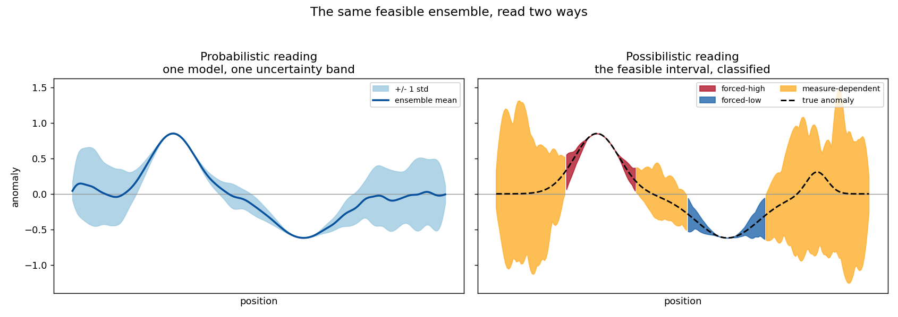
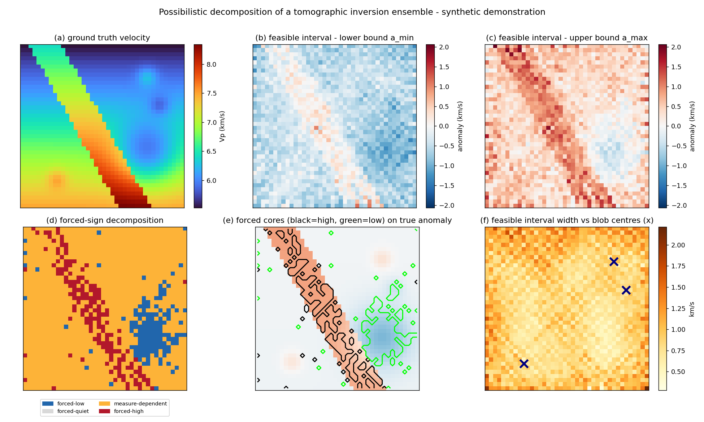
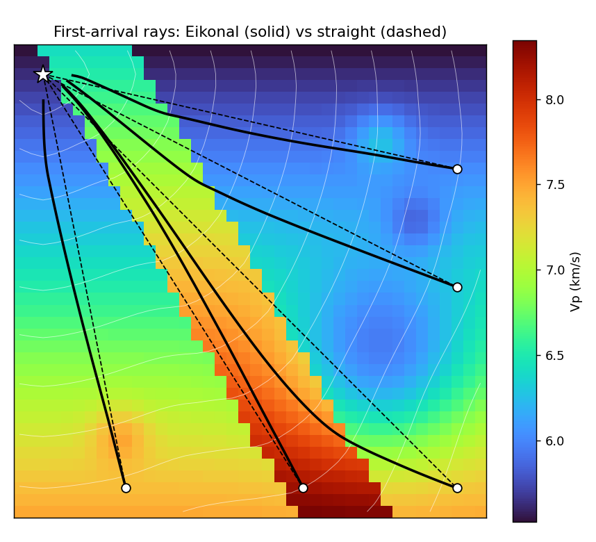
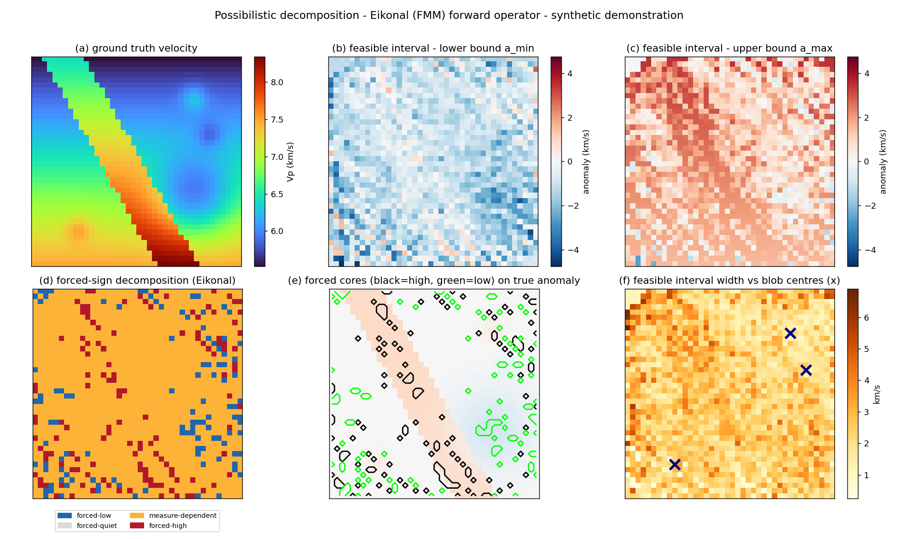

# Possibilistic Decomposition of a Tomographic Inversion

### Separating data-forced structure from regularization artifact

**Aaron Green** — draft prepared for Zagid Abatchev, 2026-05-17.

---

## What this is

A tomographic image is not a picture of the Earth. It is the output of a long
chain of lossy, selective steps — sparse rays, a simplified forward model, a
parameterization, a regularizer, an optimizer — and what survives that chain is
not the structure but a *filtered residue* of it. You and I have said as much
to each other already. The practical question that framing forces is the one
this note is about:

> **Given a finished inversion, which features did the data force, and which
> did the regularization invent?**

Standard practice does not answer that question. It picks a damping value,
returns one model, and attaches a posterior covariance — and every part of that
is conditional on the damping choice. Your own thesis says it plainly: "there
is no simple solution for regularization, and optimization of damping
conditions remains a highly parametrization and input dependent problem"
(ZTM/TFM, §11).

This note proposes a different reading of an inversion — a **possibilistic**
one — and demonstrates it end-to-end on synthetic travel-time tomography with
two forward operators, straight-ray and Eikonal. It is a methods communication
and a draft; the demonstrations are synthetic; nothing here is claimed as
proven. What I am claiming is that the reading is sound, that it is implemented
and validated against known ground truth, and that the place it stops working
cleanly is a real open problem worth our working on together.

---

## 1. The problem: a damping choice is not a fact

Tomographic inversion is ill-posed. Many models fit the data within noise. To
return *one* model you must regularize — damp, smooth, prefer a reference —
and the model you get is as much a property of that choice as of the data.

The honest consequence: a feature in a tomographic image belongs to one of
three classes, and they are not the same kind of thing.

| Class | Meaning |
|---|---|
| **Forced** | Present in *every* model consistent with the data and the hard physical bounds. Data-determined. Independent of the damping choice. |
| **Forbidden** | Present in *no* such model. |
| **Measure-dependent** | Present in *some* consistent models and absent in others. Which ones you see is set by your regularization — these features are artifacts of the choice, not of the data. |

A posterior covariance does not draw this line. It reports a spread *under one
prior and one damping*; it cannot tell you that a given feature would vanish
under a different, equally defensible choice. The damping problem of §11 is, in
this language, a symptom of reading an inversion through the wrong layer: it is
the search for the "right" measure-layer choice to extract a model, when the
features that *depend* on that choice are exactly the ones the data does not
determine.

---

## 2. The possibilistic frame

The distinction in §1 is the **possibilistic / probabilistic** split, taken
from the two-layer discipline of the Closure Forces Structure programme
(`inverse_born_methodology.md`) and carried over to inversion:

- The **possibilistic layer** asks what is *forced or forbidden* by the data
  and the hard physical constraints alone. Its answers are unconditional — they
  do not depend on a prior, a damping value, or a measure.
- The **probabilistic layer** asks how a measure distributes weight over what
  the possibilistic layer permits. Its answers are conditional on that measure.

A posterior covariance lives entirely in the probabilistic layer. The
possibilistic layer is the one that answers the §1 question, and it is the one
standard tomography leaves on the table.

The object that carries it is the **feasible interval**. Take an ensemble of
models that each fit the data within noise and respect the hard bounds. For
each cell, record the interval `[a_min, a_max]` of the anomaly across the
ensemble. That interval is the possibilistic content of the inversion:

- `a_min > 0` everywhere in the ensemble → **forced-high** (no data-consistent
  model makes this cell non-positive);
- `a_max < 0` → **forced-low**;
- the interval straddles zero → **measure-dependent** (the sign itself is not
  data-forced);
- the interval sits inside a small band around zero → **forced-quiet**.

Figure 1 is the whole idea in one cartoon. The same ensemble, read two ways:
the probabilistic reading collapses it to a mean and an error band; the
possibilistic reading keeps the feasible interval and classifies it. The big
feature is forced; the flanks and the small bump are measure-dependent — and
the probabilistic band does not distinguish them.

*Figure 1. The same feasible ensemble, read two ways. Left: one model, one
uncertainty band. Right: the feasible interval, classified.*

**On prior art — said straight.** This is not unprecedented, and pretending
otherwise would not survive five minutes of your scrutiny. Computing bounds on
what a model *can* be, rather than a single estimate, is the spirit of
Backus–Gilbert extremal inversion (1968); the under-determined directions are
the null space of resolution analysis; multi-model joint coupling has the
Gramian-constraint literature (Zhdanov, 2012 onward). What I am putting forward
is narrower and, I think, still open: a *disciplined* reading in which
measure-dependence is treated as the operational diagnostic of artifact, the
forced/forbidden split is a first-class output, and the whole thing is run as a
transferred, documented methodology rather than an ad-hoc robustness check.

---

## 3. Method

**The feasible set.** A model is *feasible* if it (a) fits the data to within
the noise level and (b) satisfies the hard physical bounds. The bounds are not
left implicit: `geophysical_invariants.md` stratifies them into Tier-1
(frame-independent — positivity, first-arrival minimality, a generous velocity
envelope; used freely), Tier-2 (frame-dependent — typical mantle/crust values,
reference Earth models, petrophysical relations; soft priors only), and Tier-3
(the observational context). The possibilistic feasible set is bounded by
Tier-1 alone. Worth noting in passing: TFM currently clamps node velocities to
7.5–9.5 km/s and initializes from IASP91 — Tier-2 values used as hard limits.
That is the layer-confusion the stratification is meant to catch.

**Sampling it.** Generate many feasible models by inverting toward many random
reference models, each inversion taken to the point where its misfit equals the
noise level. The references diversify the data-null directions; the
data-resolved directions are common to all. Then read the feasible interval
and classify it (§2).

**The decomposition is forward-model-agnostic.** It operates on the ensemble of
models; it does not care how they were produced. That is the point of the two
demonstrations below: the *same* decomposition code runs on a linear straight-
ray operator and a nonlinear Eikonal operator.

---

## 4. Demonstration 1 — straight-ray operator (linear)

A synthetic velocity model: one large tilted high-velocity slab, one broad
low-velocity zone, three small sub-resolution blobs. Synthetic first-arrival
times with 1.2% noise, dense four-edge ray coverage. The feasible set is
sampled exactly per §3 (the linear operator admits an exact eigendecomposition,
so the feasible set is parametrized cleanly).

Figure 2 is the result. The forced-sign cores sit on the true features — panel
(e), the black forced-high contour lies inside the true slab, the white
forced-low contour inside the true low-velocity zone. The numbers:

- **Forced cores are correct.** ~7 sign errors within the resolution length out
  of ~300 forced cells (~2%). What the method certifies, the ground truth
  bears out.
- **The measure-dependent shell captures ~89% of the sub-resolution blob
  cells** — it correctly flags the detail the data cannot pin down.
- **The forced set is conservative**: ~19% of the grid is sign-certain. This is
  not a weakness. It is the method saying out loud what is true — most of a
  tomographic image is *not* forced.

*Figure 2. The straight-ray (linear) demonstration. Panel (d) is the
decomposition; panel (e) shows the forced cores landing on the true features.*

---

## 5. Demonstration 2 — Eikonal operator (nonlinear)

The straight-ray operator is exact only in a homogeneous medium. The faithful
operator is the Eikonal first-arrival solver — the operator class your FMM.cpp
implements. First-arrival rays bend: toward fast structure, away from slow
(Figure 3). `eikonal.py` provides it (Fast Marching Method solver + ray-path
Fréchet kernel), standalone and self-tested.

*Figure 3. Why the forward operator matters. Solid: Eikonal first-arrival rays,
bending through the medium. Dashed: the straight-ray approximation.*

Because travel time is now a nonlinear functional of slowness, the one-shot
linear solve is replaced by an iterative Levenberg–Marquardt inversion that
recomputes the ray paths through the current model — the DGN + FMM structure of
your own pipeline. Figure 4 is the result, and the decomposition code is
*identical* to Demonstration 1:

- **Forced cores ~89–93% sign-correct**, 8 sign errors out of ~240 forced cells
  (~3%) — the same quality band as the linear case.
- **The measure-dependent shell captures ~76% of the blobs.**

The decomposition transferred across two genuinely different forward operators
without change. That is the load-bearing result of this note: the possibilistic
reading is a property of *inversions*, not of a particular operator.

*Figure 4. The Eikonal (nonlinear) demonstration — same decomposition, faithful
operator.*

---

## 6. What building it surfaced — the discipline the method needs

A method that always says "yes" is a gimmick. This one has real failure modes,
and finding them is how I know it has content. Each was surfaced by a synthetic
run failing honestly; each is now documented in the script headers.

1. **The ensemble must sample the feasible set's diversity, or it certifies its
   own bias.** An ensemble built by varying damping *strength* alone shares a
   bias in the data-null directions; the intersection then stamps that shared
   bias "forced." The fix is many random references.
2. **Sample where the data is actually fit** — at the misfit = noise level. An
   over-damped ensemble has had data-resolved structure regularized away.
3. **"Forced" is a sign statement off the interval, not a hard threshold.** A
   single anomaly-magnitude cutoff is brittle; the feasible interval is the
   honest object.
4. **Precision is honest only at the resolution length.** Every feasible model
   inherits the same forward-operator blur; the forced core is correct to
   within roughly one cell, not cell-exact.
5. **Feasible models must be physically plausible — smooth.** The raw null
   space of a ray (line-integral) operator is dominated by high-frequency
   checkerboard modes the operator cannot see. Those fit the data but are not
   admissible Earth models; perturbing freely in them injects unphysical
   speckle. A feasible model is data-fitting *and* smooth.

These are not patches. They are the methodology's anti-anchoring discipline —
the same one that, in the Closure programme, keeps a derivation from quietly
tuning itself to the answer it wants.

---

## 7. The open frontier — and where you come in

Here is the honest seam, and it is the reason this is a note to *you* and not
a finished claim.

The linear straight-ray case has a clean, exact answer: the operator is fixed,
`GᵀG` eigendecomposes once, and the feasible set is parametrized directly. The
nonlinear case does not. Sampling the feasible set of a nonlinear inverse
problem — getting genuine diversity in the data-null directions without
injecting artifacts — is itself a hard problem. Building Demonstration 2 walked
straight into it: a naive Levenberg–Marquardt ensemble shares an
inversion-dynamics bias; fixing that needs explicit, physically-constrained
feasible-set sampling. I have a working version, but I would not call the
nonlinear feasible-set sampler solved.

This is exactly the territory of transdimensional / reversible-jump MCMC
tomography (Bodin & Sambridge, 2009 onward) — methods built precisely to
produce a genuine posterior ensemble. And it is where ZTM already lives: your
`runs=20` top-level Monte Carlo *is* a feasible-set sampler. The open question
— a real one, not rhetorical — is whether 20 runs sample the feasible set well
enough for the forced/measure-dependent split to be trustworthy on real data,
or whether it needs the transdimensional treatment.

That question is not mine to answer from the outside. It needs your inversion
expertise, your code, and your data. My contribution is the possibilistic
reading and the formal scaffolding behind it; yours is the geophysics and the
instrument. Neither half is sufficient alone. That is the collaboration I am
proposing — not "adopt this method," but "here is a method, validated in the
linear case, and here is the concrete nonlinear problem your own pipeline is
already engaging. Let us solve that part together."

---

## 8. Honest scope

- Everything here is **synthetic**. The demonstrations validate the *method*
  against known ground truth; they are not a result about the real Earth.
- The Eikonal solver is **first-order FMM**. Its ~2% mean accuracy is fine for
  a forward-model-agnostic demonstration; your FMM-VFD hybrid is the
  production-grade version.
- Two dimensions, modest velocity contrasts, a single noise realization. None
  of the conclusions depend on scale, but none have been *tested* at scale.
- The forced/measure-dependent split is **operator-relative**: it reports what
  is forced *given a forward operator*. An operator with systematic error
  propagates that error into the forced set. This is not a defect of the
  method — it is the method correctly reflecting the operator — but it means
  the operator's fidelity is load-bearing.

---

## Pointers

- `geophysical_invariants.md` — the stratified constraint set.
- `synthetic_demo.py`, `synthetic_demo_eikonal.py` — the two demonstrations.
- `eikonal.py` — the standalone Eikonal forward operator (self-test:
  `uv run python eikonal.py`).
- `inverse_born_methodology.md` (Closure Forces Structure programme) — the
  source of the two-layer possibilistic / probabilistic discipline.
- Bodin, T. & Sambridge, M. (2009), *Seismic tomography with the reversible
  jump algorithm*, Geophys. J. Int. — the transdimensional-sampling reference.
- Abatchev, Z. (2019), ZTM/TFM, UCLA — the joint seismic+gravity inverter this
  note is in conversation with.
